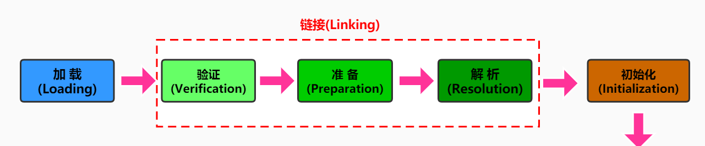

# 类加载子系统

### 1. 内存结构概述

JVM结构简图：


JVM结构详细图：


### 2. 类加载器与类的加载过程

##### 2.1 类加载子系统作用
▲ 类加载子系统负责从文件系统或者网络中加载Class文件，class文件在文件开头有特定的文件标识；
▲ ClassLoader只负责class文件的加载，至于它是否可以运行，则由Execution Engine决定
▲ 加载的类信息存放于一块成为方法区的内存空间。除了类信息之外，方法区还会存放运行时常量池信息，可能还包括字符串字面量和数字常量（这部分常量信息是Class文件中常量池部分的内存映射）
。

##### 2.2 类加载器ClassLoader角色

ClassLoader扮演一个快递员角色，实现 .class文件 --> JVM --> 元数据模板


##### 2.3 加载过程图




##### 2.4 加载
Ⅰ. 通过一个类的全限定明获取定义此类的二进制字节流；
Ⅱ. 将这个字节流所代表的的静态存储结构转化为方法区的运行时数据；
Ⅲ. 在内存中生成一个代表这个类的`java.lang.Class`对象，作为方法区这个类的各种数据的访问入口

##### 2.5 链接

###### 验证
Ⅰ. 目的在于确保Class文件的字节流中包含信息符合当前虚拟机要求，保证被加载类的正确性，不会危害虚拟机自身安全。
Ⅱ. 主要包括四种验证，文件格式验证，源数据验证，字节码验证，符号引用验证。

###### 准备
Ⅰ. 为类变量分配内存并且设置该类变量的默认初始值，即零值；
Ⅱ. <font color='blue'>这里不包含用final修饰的sttic，因为final在编译的时候就会分配了，准备阶段会显式初始化；</font>
Ⅲ. <font color='blue'>这里不会为实例变量分配初始化</font>，类变量会分配在方法去中，而实例变量是会随着对象一起分配到java堆中。

###### 解析
Ⅰ. 将常量池内的符号引用转换为直接引用的过程。
Ⅱ. 事实上，解析操作网晚会伴随着jvm在执行完初始化之后再执行
Ⅲ. 符号引用就是一组符号来描述所引用的目标。符号应用的字面量形式明确定义在《java虚拟机规范》的class文件格式中。直接引用就是直接指向目标的指针、相对偏移量或一个间接定位到目标的句柄
Ⅳ. 解析动作主要针对类或接口、字段、类方法、接口方法、方法类型等。对应常量池中的CONSTANT_Class_info/CONSTANT_Fieldref_info、CONSTANT_Methodref_info等。

###### 初始化
Ⅰ. 初始化阶段就是执行类构造器方法`clinit()`的过程。
Ⅱ. 此方法不需要定义，是javac编译器自动收集类中的所有类变量的赋值动作和静态代码块中的语句合并而来。 **我们注意到如果没有静态变量c，那么字节码文件中就不会有clinit方法**


Ⅲ. 构造器方法中指令按语句在源文件中出现的顺序执行


Ⅳ. clinit()不同于类的构造器。（关联：构造器是虚拟机视角下的init()）
Ⅴ. 若该类具有父类，jvm会保证子类的clinit()执行前，父类的clinit()已经执行完毕


Ⅵ. 虚拟机必须保证一个类的clinit()方法在多线程下被同步加锁。


### 3. 类加载器分类

▲ JVM支持两种类型的类加载器：<font color='red'>引导类加载器(Bootstrap ClassLoader)</font>和<font color='red'>自定义类加载器(User-Defined ClassLoader)</font>
▲ 所有派生于抽象类ClassLoader的类加载器都划分为自定义类加载器(包括系统类加载器和拓展类加载器)

``` java
/**
 * ClassLoader加载
 */
public class ClassLoaderTest {
    public static void main(String[] args) {
        //获取系统类加载器
        ClassLoader systemClassLoader = ClassLoader.getSystemClassLoader();
        System.out.println(systemClassLoader);//sun.misc.Launcher$AppClassLoader@18b4aac2

        //获取其上层  扩展类加载器
        ClassLoader extClassLoader = systemClassLoader.getParent();
        System.out.println(extClassLoader);//sun.misc.Launcher$ExtClassLoader@610455d6

        //获取其上层 获取不到引导类加载器
        ClassLoader bootStrapClassLoader = extClassLoader.getParent();
        System.out.println(bootStrapClassLoader);//null

        //对于用户自定义类来说：使用系统类加载器进行加载
        ClassLoader classLoader = ClassLoaderTest.class.getClassLoader();
        System.out.println(classLoader);//sun.misc.Launcher$AppClassLoader@18b4aac2

        //String 类使用引导类加载器进行加载的  -->java核心类库都是使用引导类加载器加载的
        ClassLoader classLoader1 = String.class.getClassLoader();
        System.out.println(classLoader1);//null

    }
}

```

##### 3.1 虚拟机自带的加载器

▲ <font color='blue'>对于用户自定义类来说：使用系统类加载器AppClassLoader进行加载</font>
▲<font color='blue'> java核心类库都是使用引导类加载器BootStrapClassLoader加载的</font>


###### 启动类加载器 
> 又称引导类加载器,Bootstrap ClassLoader

- 这个类加载**使用C/C++语言实现**的，嵌套在JVM内部
- 它用来加载java的核心库（`JAVA_HOME/jre/lib/rt.jar/resources.jar`或`sun.boot.class.path`路径下的内容），用于提供JVM自身需要的类
- 并不继承自`java.lang.ClassLoader`,**没有父加载器**
- 加载拓展类和应用程序类加载器，并指定为他们的父加载器
- 出于安全考虑，BootStrap启动类加载器只加载包名为java、javax、sun等开头的类

###### 拓展类加载器
> (Extension ClassLoader)

- java语言编写 ，由`sun.misc.Launcher$ExtClassLoader`实现。
- 派生于ClassLoader类
- 父类加载器为启动类加载器
- 从java.ext.dirs系统属性所指定的目录中加载类库，或从JDK的安装目录的`jre/lib/ext`子目录（扩展目录）下加载类库。**如果用户创建的JAR放在此目录下，也会由拓展类加载器自动加载**

###### 应用程序类加载器
> (系统类加载器， AppClassLoader)

- java语言编写， 由`sun.misc.Launcher$AppClassLoader`实现。
- 派生于ClassLoader类
- 父类加载器为拓展类加载器
- 它负责加载环境变量classpath或系统属性` java.class.path`指定路径下的类库
- **该类加载器是程序中默认的类加载器**，一般来说，java应用的类都是由它来完成加载
通过ClassLoader#getSystemClassLoader()方法可以获取到该类加载

代码演示：


``` java
/**
 * 虚拟机自带加载器
 */
public class ClassLoaderTest1 {
    public static void main(String[] args) {
        System.out.println("********启动类加载器*********");
        URL[] urls = sun.misc.Launcher.getBootstrapClassPath().getURLs();
        //获取BootStrapClassLoader能够加载的api路径
        for (URL e:urls){
            System.out.println(e.toExternalForm());
        }

        //从上面的路径中随意选择一个类 看看他的类加载器是什么
        //Provider位于 /jdk1.8.0_171.jdk/Contents/Home/jre/lib/jsse.jar 下，引导类加载器加载它
        ClassLoader classLoader = Provider.class.getClassLoader();
        System.out.println(classLoader);//null

        System.out.println("********拓展类加载器********");
        String extDirs = System.getProperty("java.ext.dirs");
        for (String path : extDirs.split(";")){
            System.out.println(path);
        }
        //从上面的路径中随意选择一个类 看看他的类加载器是什么:拓展类加载器
        ClassLoader classLoader1 = CurveDB.class.getClassLoader();
        System.out.println(classLoader1);//sun.misc.Launcher$ExtClassLoader@4dc63996
    }
}

```
##### 3.2用户自定义类加载器

▲ 为什么要自定义类加载器？
① 隔离加载类
② 修改类的加载方式
③ 拓展加载源
④ 防止源码泄露

▲ 自定义类加载器实现步骤？
① 开发人员可以通过继承抽象类`java.lang.ClassLoader`类的方式，实现自己的类加载器，以满足一些特殊的需求
② 在JDK1.2之前，在自定义类加载器时，总会去继承ClassLoader类并重写loadClass()方法，从而实现自定义的类加载类，但是在JDK1.2之后已不再建议用户去覆盖loadClass()方法，而是建议把自定义的类加载逻辑写在findClass()方法中
③ 在编写自定义类加载器时，如果没有太过于复杂的需求，可以直接继承URlClassLoader类，这样就可以避免自己去编写findClass()方法及其获取字节码流的方式，使自定乂类加载器编写更加简洁

### 4. 关于ClassLoader
▲ ClassLoader类，它是一个抽象类，其后所有的类加载器都继承自ClassLoader（不包括启动类加载器）


▲ 获取ClassLoader途径：


###  5. 双亲委派机制

> Java虚拟机对class文件采用的是<font color='red'>按需加载的</font>方式，也就是说当需要使用该类时才会将她的class文件加载到内存生成的class对象。而且加载某个类的class文件时，java虚拟机采用的是<font color='red'>双亲委派模式</font>，即把请求交由父类处理，它是一种任务委派 模式

##### 5.1 工作原理

1）如果一个类加载器收到了类加载请求，它并不会自己先去加载，而是把这个请求委托给父类的加载器去执行；
2）如果父类加载器还存在其父类加载器，则进一步向上委托，依次递归，请求最终将到达顶层的启动类加载器；
3）如果父类加载器可以完成类加载任务，就成功返回，倘若父类加载器无法完成此加载任务，子加载器才会尝试自己去加载，这就是双亲委派模式


**例：**
如图，虽然我们自定义了一个java.lang包下的String尝试覆盖核心类库中的String，但是由于双亲委派机制，启动加载器会加载java核心类库的String类（BootStrap启动类加载器只加载包名为java、javax、sun等开头的类），而核心类库中的String并没有main方法


##### 5.2 优势

① 避免类的重复加载
② 保护程序安全，防止核心API被篡改

**例：**
自定义类：`java.lang.MeDsh` (java.lang包需要访问权限，阻止我们用包名自定义类)


##### 5.3 沙箱安全机制

自定义String类，但是在加载自定义String类的时候回会率先使用引导类加载器加载，而引导类加载器在加载过程中会先加载jdk自带的文件（rt.jar包中的`java\lang\String.class`）,报错信息说没有main方法就是因为加载的是rt.jar包中的String类。这样可以保证对java核心源代码的保护，这就是沙箱安全机制

### 6. 其它

- 在JVM中表示两个class对象是否为同一个类存在的两个必要条件：
① 类的完整类名必须一致，包括包名
② 加载这个类的ClassLoader（指ClassLoader实例对象）必须相同

- 换句话说，在JVM中，即使这两个类对象（class对象）来源同一个Class文件，被同一个虚拟机所加载，但只要加载它们的ClassLoader实例对象不同，那么这两个类对象也是不相等的

##### 6.1 对类加载器的引用

**JVM必须知道一个类型是有启动类加载器加载的还是由用户类加载器加载的**。如果一个类型由用户类加载器加载的，那么jvm会将这个类加载器的一个引用作为类型信息的会议部分保存在方法区中。当解析一个类型到另一个类型的引用的时候，JVM需要保证两个类型的加载器是相同的。

##### 6.2 类的主动使用和被动使用

Java程序对类的使用方式分为：主动使用和被动使用

###### 主动使用
①创建类的实例
②访问某各类或接口的静态变量，或者对静态变量赋值
③调用类的静态方法
④反射 比如`Class.forName`(`com.dsh.jvm.xxx`)
⑤初始化一个类的子类
⑥java虚拟机启动时被标明为启动类的类
⑦JDK 7 开始提供的动态语言支持：
`java.lang.invoke.MethodHandle`实例的解析结果REF_getStatic、REF_putStatic、REF_invokeStatic句柄对应的类没有初始化，则初始化

###### 被动使用

除以上7种情况，其它使用Java类的方式都被看作是对类的被动使用，<font color='red'>都不会导致类的初始化。</font>

**例子：**
//TODO 待补充...
