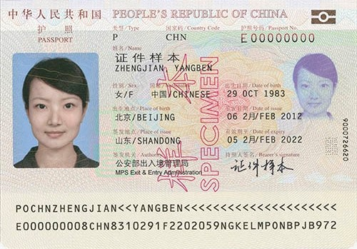
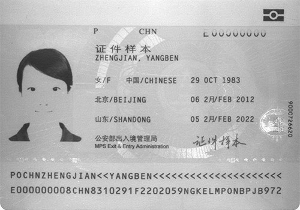
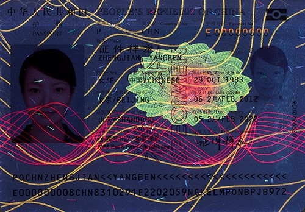
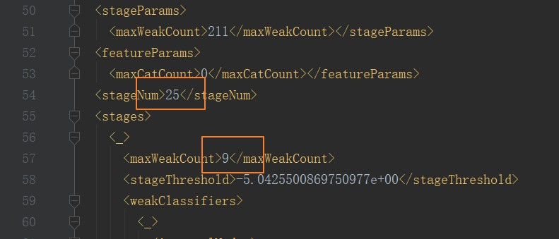
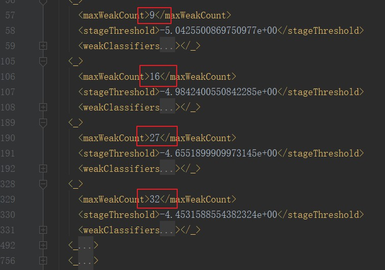
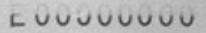
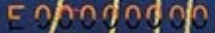
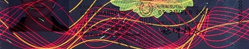
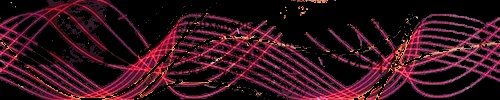
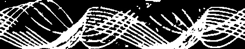

# 护照防伪算法实验


## 1.防伪特征分析

本次实验，研究基于多光谱图像的防伪算法，总共获得护照的可见光图像、红外光图像和紫外光图像，示例图如下：

  


  


   

在原论文中，选择如下4个防伪特征：
1. 红外光下人脸图像消失
2. 红外光下护照号码部分消失(只显示下半部分)
3. 紫外光下护照号码荧光反应(只显示上半部分)
4. 紫外光下红色亮条纹

## 2.红外光下人脸图像鉴伪

### 2.1人脸检测原理（主要研究Viola-Jones算法）

#### 描述
人脸检测目标是找出图像中人脸对应的位置，输出人脸外接矩形在图像中的坐标，可能还包括姿态如斜角度等信息

#### 问题
- 人脸可能出现在图像中的任何一个位置
- 人脸可能有不同的大小
- 人脸在图像中可能有不同的视角和姿态
- 人脸可能部分被遮挡
还有其它如：光照不均匀导致脸部色彩畸变，肤色、表情不同，附带胡须、眼镜等问题

#### 评价指标：
检测率、误报率、速度、鲁棒性  
目标：尽可能实现高检测率，低误报率，且检测速度快，算法鲁棒性好

#### 经典人脸检测算法流程：
1. 先训练一个人脸二分类器，用来判断输入图片是否有人脸
2. 然后利用多尺度滑动窗口技术，检测出人脸位置。
3. 最后采用非极大值抑制（NMS）方法对候选框进行合并去重

#### 人脸检测算法发展历史：

##### 早期算法
模板匹配算法、子空间方法、变形模板匹配

##### Viola-Jones人脸检测算法
使用Haar等算子进行特征提取，通过AdaBoost框架对这些特征向量进行训练，得到人脸检测的强分类器，再使用Cascade级联分类器

##### 深度学习时期
Cascade CNN  
DenseBox  
Faceness-Net  
MTCNN  
Face R-CNN  
SSH  
Pyramid-Box  
...  

#### Viola-Jones算法
算法步骤：  
１　使用Haar-like特征做检测提取人脸的共有属性  
２　使用积分图（Integral Image）对Haar-like特征求值进行加速  
３　使用AdaBoost算法训练区分人脸和非人脸的强分类器  
４　使用筛选式级联把强分类器级联到一起，提高准确率  

#### Haar特征提取
之所以采用Haar-like特征，是因为Haar特征在一定程度上反应了图像灰度的局部变化，在人脸检测中，脸部的一些特征可由矩形特征简单刻画，例如，眼睛比周围区域的颜色要深，鼻梁比两侧颜色要浅等。

Haar-like特征模板分为如下四组：


其中原始的Haar-like特征有5个：1-(a)、1-(b)、2-(a)、2-(b)、4

特征模板在原图上滑动，类似滤波操作，并将白色区域的像素值减去黑色区域的像素值，计算得到Haar-like特征值。

因为Haar-like模板有多种，且模板的位置、大小不定，因此可以提取出大量的Haar-like特征值。

以一个24×24的原始图为例子，我们只选择原始算法的特征模板，则特征模板有1×2、2×1、1×3、3×1、2×2共5种宽高比，根据对称性只需要计算三个，计算代码如下：

```python
import numpy as np

a = np.zeros((3, 2), dtype=int)
Count = np.zeros(3, dtype=int)
a[0, :] = [1, 2]
a[1, :] = [1, 3]
a[2, :] = [2, 2]

Img_size = 24

for ii in range(3):
    rec_h = a[ii, 0]
    rec_w = a[ii, 1]
    for xx in range(rec_h, Img_size+1, rec_h):
        for yy in range(rec_w, Img_size+1, rec_w):
            Count[ii] = Count[ii]+(Img_size-xx+1)*(Img_size-yy+1)
    print(Count[ii])

Total = Count[0]*2+Count[1]*2+Count[2]
print("Total: ", Total)

```
计算结果：
```python
43200
27600
20736
Total:  162336
```

如果提高图片分辨率，将需要计算更多的特征值，如果对每一个特征模板，都采用遍历区域内所有像素然后再进行求和相减等操作，计算量巨大，将达不到实时性的要求，满足不了我们对速度的评价指标，因此引入积分图加速运算。

#### 快速计算-积分图
什么是积分图：
对图像中每个坐标(x,y)，定义其对应图中左上角像素值之和：
$$i i(x, y)=\sum_{x^{\prime} \leqslant x, y^{\leqslant \leqslant y}} i\left(x^{\prime}, y^{\prime}\right)$$
其中$ii(x, y)$为像素点(x,y)的积分图，$i(x, y)$表示原始图像，原始图和积分图的对应关系如下：


求原始图积分图的操作不复杂，对于大小为m×n的图像，迭代m×n×2次，就可以得到整个积分图（先按行求和，再按列求和）

通过构造积分图，可以加速Haar-like模板特征求值运算，举下面这个例子：


要计算区域D的像素值和，原来会直接统计该区域内所有像素之和。但是我们现在有了一个新的方法，即：首先针对原图创建一个积分图，然后，就可以直接利用公式：
$区域D像素值=(ii_4+ii_1)-(ii_2+ii_3)$
求出区域D的像素值之和了，可以看出，无论特征模板大小如何，计算时间都是固定的，因此利用积分图可以加快运算速度。

对于Haar-like的5个原始特征模板，采用同样的方式可以得到相应的表达式

#### AdaBoost框架
AdaBoost是一种统计学习方法，属于机器学习中的集成学习

##### 集成学习
通过构建并结合多个个体学习器来完成学习任务

个体学习器通常由一种现有机器学习算法训练产生，如C4.5决策树、BP神经网络等。若所有个体学习器使用相同的算法，则这样的集成是“同质”的，个体学习器也称为基学习器，若使用不同算法，这样的集成是“异质”的，个体学习器也称为组件学习器。

集成学习的思想：“三个臭皮匠，顶个诸葛亮”，我们通过将多个弱分类器结合，达到强分类器的效果，但是训练弱分类器更简单，更快速，而且一般情况下有着更小的方差和偏差。根据Hoeffding不等式可知，随着集成中的个体分类器数量增加，集成的错误率呈现指数级下降（基于每一个基学习器相互独立的前提，这一前提现实并不成立），所以理论上集成学习可以获得很好的性能。

因为实际情况下，前提假设并不成立，所以集成学习研究的核心就是保证个体学习器的“准确性”和不同学习器的“多样性”。

集成学习有两种主要的思路：bagging和boosting

###### bagging

bagging的核心思想就是民主，每个个体学习器权值一样，大部分情况下，经过bagging得到的方差更小。
代表性的算法是随机森林（bagging+决策树）

###### boosting

boosting的核心思想就是挑选精英，即对待每个个体学习器是不一样的，对于误差率小的权值更大，经过boosting得到的结果偏差更小。
主流的算法有AdaBoost和Gradient boosting

##### AdaBoost原理
具体原理可以参考西瓜书或者统计学习方法，这里给出算法整体流程：

>输入： 训练数据集 $T=\left\{\left(x_{1}, y_{1}\right),\left(x_{2}, y_{2}\right), \cdots\left(x_{N}, y_{N}\right)\right\}, \quad y \in\{-1,+1\},$ 基学习器 $G_{m}(x),$ 训练轮数M
>1. 初始化权值分布: $\quad w_{i}^{(1)}=\frac{1}{N}, \quad i=1,2,3, \cdots N$  
>2. for $m=1$ to $\mathrm{M}:$  
>(a) 使用带有权值分布的训练集学习得到基学习器 $\$ G_{-} m(x)$   
>$G_{m}(x)=\underset{G(x)}{\arg \min } \sum_{i=1}^{N} w_{i}^{(m)} \mathbb{I}\left(y_{i} \neq G\left(x_{i}\right)\right)$  
>(b) 计算 $G_{m}(x)$ 在训练集上的误差率:  
>$\epsilon_{m}=\frac{\sum_{i=1}^{N} w_{i}^{(m)} \mathbb{I}\left(y_{i} \neq G_{m}\left(x_{i}\right)\right)}{\sum_{i=1}^{N} w_{i}^{(m)}}$  
>(c) 计算 $G_{m}(x)$ 的系数: $\quad \alpha_{m}=\frac{1}{2} \ln \frac{1-\epsilon_{m}}{\epsilon_{m}}$  
>(d) 更新样本权重分布: $\quad w_{i}^{(m+1)}=\frac{w_{i}^{(m)} e^{-y_{i} \alpha_{m} G_{m}\left(x_{i}\right)}}{Z^{(m)}}, \quad i=1,2,3 \cdots N$  
>其中 $Z^{(m)}$ 是规范化因子, $\quad Z^{(m)}=\sum_{i=1}^{N} w^{(m)} i e^{-y_{i} \alpha_{m} G_{m}\left(x_{i}\right)},$ 以确保所有的  
>$w_{i}^{(m+1)}$ 构成一个分布  
>3. 输出最终模型:  $\quad G(x)=\operatorname{sign}\left[\sum_{m=1}^{M} \alpha_{m} G_{m}(x)\right]$

#### 筛选式级联

前面已经通过AdaBoost算法集成了一个强学习器，通过这样一系列训练得到的强分类器，级联形成了人脸检测器（类似一个退化的决策树）

在保证每个强分类器可以通过几乎所有人脸、拒绝大部分非人脸的前提下，组成强分类器的弱分类器个数随着级数的增加而增加，这样越往后检测率越高，误报率越低，结果就更精准。虽然后面的强分类器计算量增加，但是在前面已经过滤掉了大量不符合要求的窗口，所以真正引起所有层计算的候选框特别少。这样就可以保证人脸检测的速度很快。

### 2.2VJ算法的实现

VJ算法具体实现可以参考opencv库，代码十分庞大复杂。前面我们比较详细地说明了vj算法的四个主要步骤，即：Haar特征提取、积分图快速计算、AdaBoost训练以及进行Cascade级联分类器。但很多细节并未提到，比如，Haar特征值是以什么样的形式作为AdaBoost训练的样本的，Haar特征值的标准化，弱分类器和强分类器的结构等等

#### Haar特征值如何作为样本训练AdaBoost框架
首先，为了保证在灰度分布均匀的位置，计算得到的Haar特征值为0，需要根据特征模板黑色和白色的面积大小赋予相应的权值，比如Haar特征模板1(a)的黑色和白色区域权值均为1，而2(a)的黑色和白色权值分别为2和1，这样就可以计算出正确的Haar特征值。

然后，因为Haar特征模板大小不固定，因此不同的Haar模板得到的特征值波动范围不一致。比如面积大的模板可能特征值可以达到1000，而面积小的特征模板最大只有100，所以需要对Haar特征值进行标准化。opencv中的实现方法如下：
1. 计算检测窗口中间部分$(w-2)(h-2)$ 的图像的灰度值和灰度值平方和：
$$
\operatorname{sum}=\sum i(x, y) \text { sqsum }=\sum i^{2}(x, y)
$$
2. 计算平均值：
$$
\text {mean}=\frac{\operatorname{sum}}{w^{*} h} \quad \text {sqmean}=\frac{\text {sqsum}}{w^{*} h}
$$
3. 计算标准化因子：
$$
\text {varNormFactor}=\sqrt{\text {sqmean}-\text {mean}^{2}}
$$
4. 标准化特征值：
$$
\text {normValue}=\frac{\operatorname{featureValue}}{varNormFactor}
$$

对于Haar特征值如何作为AdaBoost样本，举个例子就一目了然，如下图：


假设用于训练的人脸图像尺寸为20×20，共2706个人脸图片，然后此时在两个不同位置计算Haar特征值(特征模板也可不同)，得到如下特征值分布曲线：


可以看出不同的Haar特征对样本有不同的分类效果，这样一个个一维的特征值构成了AdaBoost的训练样本。我们可以看到，左边特征的特征值基本上大于0，而右边的特征值对于人脸样本则分布均匀，如果我们简单认为当前0为阈值，那么明显左边的特征效果更好，因为它成功把所有人脸样本分为了一类，这就说明该特征模板在该位置得到的Haar特征值有着不错的效果

#### 弱分类器和强分类器结构

这里我们对照opencv中提供的训练好模型：`haarcascade_frontalface_default.xml`进行分析。自上而下依次是级联分类器、强分类器、弱分类器。级联分类器总共由25个强分类器组成，可以看做是退化的决策树，只有这些强分类器输出均检测为人脸，整个分类器才会判断当前窗口为人脸。每个强分类器由若干个弱分类器组成，所有的弱分类器均使用决策树算法，且每个决策树都很浅，大部分为两层。而且这25个强分类器的准确度越来越高，或者说构成它们的弱分类器数目大体上越来越多，从上到下依次为：9->16->27->32->52->53->62->72->83->91->99->115->127->135->136->137->159->155->169->196->197->181->199->211->200
因此通过前面的简单的强分类器排除大量无效窗口，可以减少计算量，提高整体运行速度。部分xml数据如下图：






#### 对输入图片进行人脸检测时，是改变图片尺度，还是改变窗口大小
有一个问题：检测窗口大小固定的级联分类器如何遍历图像，以便找到在图像中大小不同、位置不同的人脸？

这里有两种思路：
1. 把图像按照一定比例缩小，构建一个图像金字塔，然后滑动检测窗口进行检测
2. 把检测窗口按照长宽比逐渐放大，然后滑动检测窗口来检测

OpenCV中同时实现了这两种搜索方式，通过设置函数`detectMultiScale`中的参数flags进行设定，默认使用放大检测窗口的方式

#### 什么是NMS
有时候检测到的部分窗口很零散，这种情况很可能是误检测，需要舍弃，有时候检测到的部分窗口十分集中，这种情况是它们均表示一张人脸，我们需要进行去重合并，实现这样的功能就称为非极大值抑制(NMS)

NMS算法主要涉及2个关键步骤：
1. 并查集的构建
2. 相似度的计算及并查集合并

具体参考OpenCV源码


## 3.护照号码鉴伪分析

### 3.1红外光下护照号码鉴伪
红外光下，护照号码基本上只显示下半部分：



背景简单，颜色单一，直接转换为灰度图后进行阈值分割转换为二值图，然后通过水平投影可以知道字符的宽度只有完整号码的一半，并以此为依据进行判断。

### 3.2紫外光下护照号码鉴伪
紫外光下，护照号码基本只显示上半部分：



可以发现背景有黄色条纹，字符本身也呈现橘红色，直接转换为灰度图无法消除条纹干扰，因此先转换到HSV空间，分类出红色区域，然后再进行灰度转换和阈值分割得到二值图，进行相同操作。

这部分原理比较简单，直接参考代码实现。不足之处是号码的位置是直接粗提取的，分割字符以及判断字符宽度的步骤设置了很多经验阈值，因此只有在比较稳定的环境和条件下才能达到预定的效果


## 4.紫外光下条纹鉴伪
### 4.1条纹分析
通过粗提取得到条纹区域：



背景干扰很多，同样通过转换到HSV空间提取出亮红色条纹：



然后进行灰度转换和大津法阈值分割：



接下来就使用ORB(Oriented FAST and Rotated BRIEF)算法对红色亮条纹进行特征点匹配：

### 4.2ORB算法原理

ORB(Oriented FAST and Rotated BRIEF)算法是对FAST特征点检测和BRIEF特征描述子的一种结合，在原有的基础上做了改进与优化，使得ORB特征具备多种局部不变性，并提高了了运算的实时性


#### 特征点检测

ORB使用FAST算法的改进版本检测角点，FAST的核心思想就是找出那些卓尔不群的点，具体来说，就是如果一个点和它周围的大部分点都不同，那么就可以认为它是那个特别的点，可能是我们需要的角点。

其基本算法步骤如下：
- 对于图像中一个像素点$p$，其灰度值为$Ip$
- 以该像素点为中心考虑一个半径为3的离散化的Bresenham圆，圆边界上有16个像素(如下图所示)
- 设定一个合适的阈值t，如果圆上有n个连续像素点的灰度值小于Ip−t或者大于Ip+t，那么这个点即可判断为角点(n的值可取12或9)


一种快速方法是先检测1、5、9、13四个位置的像素，如果至少3个点符合设定阈值，则再考查其它位置点像素，否则直接pass

对于邻近位置存在多个特征点的情况,需要进一步做非极大值抑制(Non-Maximal Suppression)。给每个已经检测到的角点一个量化的值V，然后比较相邻角点的V值，保留局部邻域内V值最大的点。V可以定义为特征点与周围16个像素点灰度局对差值的和

#### 特征点描述

ORB使用BRIEF算法来计算一个特征点的描述子，其核心思想就是在关键点P的周围以一定模式选取N个点对，把这N个点对的比较结果组合起来作为描述子。因此，BRIEF是一种二进制编码的特征描述子，既降低了存储空间的需求，提升了特征描述子生成的速度，也减少了特征匹配时所需的时间

具体分为如下几步：
- 使用FAST或者Harris等方法检测特征点
- 特征点的邻域窗口Patch，并对该邻域内像素点进行σ=2、窗口尺寸为9的高斯平滑，以滤除噪声(也可直接对整幅图像做高斯平滑)
- 在邻域窗口内随机选取n对(n可取128、256等)像素点，并根据灰度值大小编码成二进制串，生成n位(bit)的特征描述子

对于随机点的采样方式有如下几种方法：
1. X、Y为均匀分布[−S/2,S/2]
2. X、Y均为高斯分布[0,S2/25]，采样准则服从各向同性的同一高斯分布
3. X服从高斯分布[0,S2/25]，Y服从高斯分布(xi,S2/100)，即采样分为两步，首先在原点处为xi进行高斯采样，然后在中心为xi处为yi进行高斯采样
4. X、Y在空间量化极坐标下的离散位置处进行随机采样
5. X固定为(0,0)，Y在空间量化极坐标下的离散位置处进行随机从采样

#### 缺陷与改进

对于理想的特征点描述子，应该具有尺度一致性和旋转一致性，即：
对于在不同的大小、方向、角度、明暗条件中图像中，同一特征点应该具有足够相似的描述子

显然，原始的FAST和BRIEF均不具备这样的特性。

通过在FAST特征提取中使用图像金字塔技术，可以解决尺度一致性的问题，对于旋转一致性，关键是要确定坐标轴方向可以跟随图片中物体的角度进行相应的改变。

对原来BRIEF算反分析可知，当我们选取点对的时候，是以当前关键点为原点，以水平方向为X轴，以垂直方向为Y轴建立坐标系，当图片发生旋转时，坐标系不变，同样的取点模式取出来的点却不一样，计算得到的描述子也不一样，因此不符合要求。所以改进的思路就是不使用固定的坐标系，使用可以跟随物体一起旋转的坐标系，具体来说，就是使用特征点到质心的向量来确定特征点的方向作为旋转方向：

$$
\begin{array}{l}
M_{00}=\sum_{x=-R}^{R} \sum_{Y=-R}^{R} I(x, y) \\
M_{10}=\sum_{X=R Y--R}^{R} \sum_{R}^{R} x I(x, y) \\
M_{01}=\sum_{X=-R Y--R}^{R} \sum_{R}^{R} y I(x, y) \\
Q_{X}=\frac{M_{10}}{M_{00}}, Q_{Y}=\frac{M_{01}}{M_{00}}
\end{array} 
$$

这样在不同旋转角度下我们的取点模式是一样的，解决了旋转一致性问题。在OpenCV中，是先随机选择256个点对，然后将这些点进行旋转，然后进行判决得到二进制串，而不是直接对整个patch进行旋转，可以减少计算量，具体参考源码。

#### 特征点匹配

我们使用汉明距离比较不同二进制串之间的汉明距离，这样可以直接使用异或操作进行计算，加快运算速度。在OpenCV中，通过设置类`BFMatcher`的参数`cv.NORM_HAMMING`指明使用汉明距离，同时该类还有一个参数`crossCheck`，表示是否使用交叉过滤。所谓交叉过滤，是指我们在配过程中很可能发生错误匹配，比如第一幅图像的某一个特征点和第二幅图像的某一个特征点匹配，如果设置`crossCheck=True`，则进行一个相反的验证，看第二幅图上的该特征点是否和第一图中同样的特征点匹配，如果匹配成功，则证明该匹配是正确的。如果我们设置`crossCheck=False`，那么可以通过比率测试排除错误匹配。具体来说，就是利用函数`KNNMatch`进行最近邻匹配，并设置其参数`K=2`，表示返回2个最近邻描述符，并通过一个经验比率阈值(一般是0.7~0.8)来和$\frac{distance1}{distance2}$进行比较，以确定哪些是好的匹配。


当好的匹配点对数量达到指定标准(实验中设置至少为10个点对)，那么说明两个亮红色条纹是匹配的

## 实验代码

代码在文件[detect.py](https://github.com/wywd/lcfl/blob/master/docs/codes/t1_passport_security_system/detect.py)中

#### 测试环境
| 平台        | 说明   |
| --------   | ------  |
| 环境     | win 10 |
| 编程语言  |  python3.7.5  |
| OpenCV   |   3.4.2     |

#### 实验结果

直接使用论文中截取出来的三张图作为护照输入，以及另一张截取出来的图作为亮红色条纹匹配模板

具体运行detect.py文件，其中实验控制台输出如下：
```
第一步：红外光下人脸图像鉴伪
没有在右半部分检测到人脸，鉴伪通过！

---------------------------

第二步：红外光下护照号码鉴伪
护照号码二值化最佳阈值为： 168.0
水平投影后字符像素统计： [ 0.  0.  0.  0.  0.  0.  0.  0.  0.  0.  0.  0.  0.  5. 31. 50. 57. 66.
 74. 69. 58. 31.  0.  0.  0.]
预设像素值阈值： 23.2
预设字符投影宽度上限： 12.5
预设字符投影宽度下限： 5.0
统计实际字符投影宽度： 8
投影宽度符合要求，鉴伪通过！

---------------------------

第三步：紫外光下护照号码防伪
护照号码二值化最佳阈值： 0.0
水平投影后字符像素统计： [ 0.  0.  0.  0.  2. 21. 44. 64. 69. 76. 71. 68. 61. 56. 38.  9.  6.  3.
  2.  0.  0.  0.  0.  0.  0.]
统计实际字符投影宽度： 9
投影宽度符合要求，鉴伪通过！

---------------------------
第四步：紫外光下条纹鉴伪
亮红色条纹二值化最佳阈值： 36.0
条纹模板二值化最佳阈值： 57.0
条纹图特征点个数：204, 条纹模板特征点个数：178, 最终匹配点数;204 
预设好的匹配点数阈值：9
好的匹配点个数： 24
红色亮条纹匹配成功，鉴伪通过！
总运行时间：1.31秒

--------------------
四步都通过，说明护照鉴伪为真
--------------------
```
其中运行时间包括载入人脸检测模型xml文件，imshow输出和图像绘制等操作


## 参考文献

[1] [李晨心.基于Android平台的护照核验鉴伪系统设计与实现](无)  
[2] [龙伶敏. 基于Adaboost的人脸检测方法及眼睛定位算法研究[D]. 电子科技大学.](https://kns.cnki.net/KCMS/detail/detail.aspx?dbcode=CMFD&dbname=CMFD2009&filename=2008122744.nh&uid=WEEvREcwSlJHSldRa1FhdkJtNEYzM3JlaVBzN2dxV1RjVHEvUlVtYzd3az0=$9A4hF_YAuvQ5obgVAqNKPCYcEjKensW4ggI8Fm4gTkoUKaID8j8gFw!!&v=MTEwMTJUM3FUcldNMUZyQ1VSN3FmYitackZ5M25VTHZPVjEyN0ZySzZITmJJcTVFYlBJUjhlWDFMdXhZUzdEaDE=)  
[3] [人脸检测算法综述-知乎](https://zhuanlan.zhihu.com/p/36621308)  
[4] [一文看懂集成学习（详解 bagging、boosting 以及他们的 4 点区别）](https://medium.com/@pkqiang49/一文看懂集成学习-详解-bagging-boosting-以及他们的-4-点区别-6e3c72df05b8)  
[5] [OpenCV AdaBoost + Haar目标检测技术内幕-知乎](https://zhuanlan.zhihu.com/p/31427728)  
[6] [OpenCV中文官方文档](http://woshicver.com/)  
[7] [ORB算法原理解读-CSDN](https://blog.csdn.net/yang843061497/article/details/38553765)  
[8] [机器学习-周志华著](无)  
[9] [统计学习方法-李航著](无)  

作者：王瑜  
2020年8月4日  

